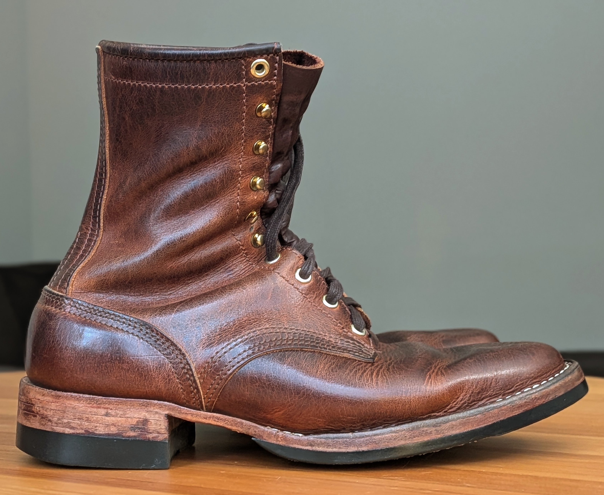
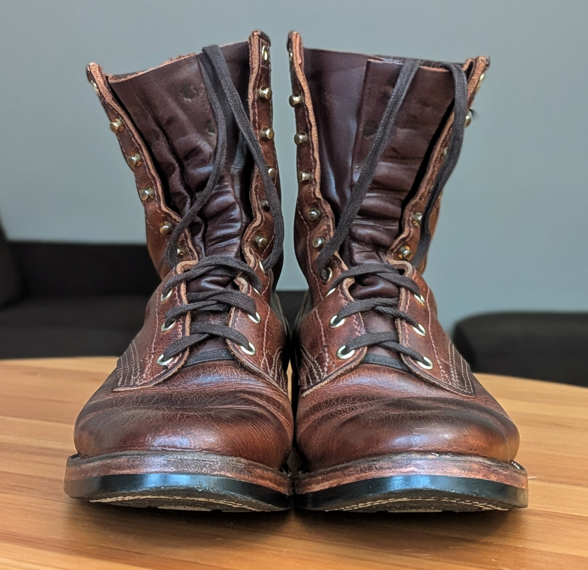

A few things I do outside of math.

::: {.section-block}
## City Streets

I am interested in how much one can learn about a city just by looking at its
streets. The starting point is [Geoff Boeing](https://geoffboeing.com/)’s work on
[urban street network orientation](https://geoffboeing.com/2019/09/urban-street-network-orientation/),
which measures how close a city is to a grid by the entropy of the distribution
of its roads. I thought it might be nice to extend this to another dimension and
look at the distribution of street angles on $\mathbb{RP}^2$. There are also
several other measures in there such as hilliness, walkability, and staircases.
Check out the interactive dashboard [here](/city-streets/).
:::

::: {.section-block}
## Leatherwork

I make small goods out of vegetable-tanned leather, mostly wallets and belts,
cutting and saddle-stitching each piece by hand. One of the things I like about
being in Chicago is that the
[Horween Leather Company](https://www.horween.com/) is here.

  

[Browse the full leatherwork gallery](leatherwork.qmd){.gallery-link}

:::

::: {.section-block}
## Boots

I like wearing leather boots :) Leather molds to your feet, breathes well, is
very durable, and ages beautifully (you should try it). Every year, Stitchdown
hosts the Patina Thunderdome, a six-month contest in which entrants wear and
care for a pair of boots, which are then judged on how they age. I placed first
in the 2025/26 Pre-Worn Thunderdome.

  🏆
  <strong><a href="https://www.stitchdown.com/patina-thunderdome/2025-26-thunderdome-winners/">Grand Prize, Patina Thunderdome 2025–2026, Pre-Worn division.</a></strong>

  <figure></figure>
  <figure></figure>
  <figure></figure>

:::
